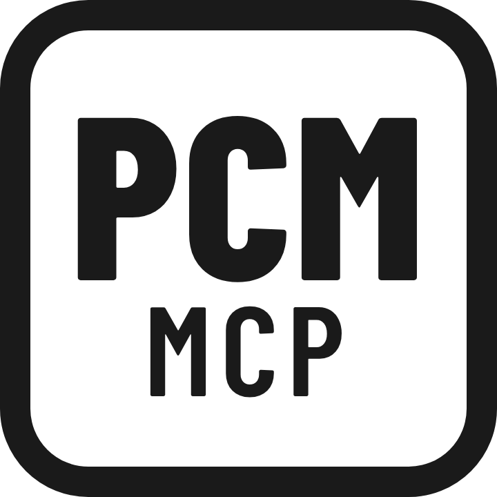

<p align="center">
  
</p>

<h1 align="center">Pro Cycling Manager MCP Server</h1>

<p align="center">
  Explore your <strong>Pro Cycling Manager</strong> career saves with an AI assistant — riders, teams, rosters and startlists, straight from the game's database.
</p>

<p align="center">
  <a href="https://www.npmjs.com/package/pcm-mcp"></a>
  <a href="https://github.com/mpicciolli/pcm-mcp/blob/main/LICENSE"></a>
  <a href="https://nodejs.org"></a>
  <a href="https://modelcontextprotocol.io"></a>
</p>

`pcm-mcp` is a [Model Context Protocol](https://modelcontextprotocol.io) server that lets AI assistants such as Claude Desktop, ChatGPT and Gemini query your [Pro Cycling Manager](https://www.cyanide-studio.com/) (PCM) game saves. Ask about a rider's ratings, browse a team's roster, run SQL against the save, or generate a race startlist — all in plain language.

> [!IMPORTANT]
> This server never modifies your existing save files. PCM stores careers as binary `.cdb` files; each call re-reads the `.cdb` from disk and loads it into an **in-memory** SQLite database. Every read tool leaves the source untouched. The write tools, `pcm_update_save` and `pcm_update_cyclist_ratings`, serialize their changes to a **new** `.cdb` file (`outputPath`) and refuse to overwrite the input — keep your original save as a backup.

## Features

- **Zero setup** — run it with a single `npx` command, or install a `.mcpb` bundle with no terminal at all.
- **Save discovery** — auto-detect PCM career saves on Windows, or point at any `.cdb` file directly.
- **Rich queries** — search cyclists and teams, inspect rosters with full per-terrain ratings, and read player info.
- **Raw SQL** — run guarded, read-only `SELECT` queries against any table in the save.
- **Guarded edits** — apply a single `INSERT`/`UPDATE`/`DELETE`, or edit a cyclist's ratings directly, and write the result to a new `.cdb`, never touching the original.
- **Startlist export** — generate a PCM-ready startlist XML from a set of teams and rosters.
- **Safe by design** — read tools are annotated `readOnlyHint: true` for auto-approval; the write tools write only to a separate output file and never overwrite an existing one.

## Getting started

### Prerequisites

- [Node.js](https://nodejs.org) 22 or later (not required for the `.mcpb` bundle install)
- A Pro Cycling Manager career save (a `.cdb` file)

### Install

<details open>
<summary><strong>MCP Bundle (Claude Desktop, no terminal)</strong></summary>

Download the latest `pcm-mcp.mcpb` from the [Releases page](https://github.com/mpicciolli/pcm-mcp/releases) and open it with **Claude for macOS or Windows**. An installation dialog appears — no terminal required.

> [!NOTE]
> This method does not auto-update. To get a newer version, download and re-install the latest `.mcpb` from the Releases page.

</details>

<details>
<summary><strong>Claude Desktop, ChatGPT Desktop or Gemini CLI (via <code>npx</code>)</strong></summary>

Add the following to your client's MCP configuration file (`claude_desktop_config.json`, the ChatGPT MCP config, or the Gemini CLI settings file):

```json
{
  "mcpServers": {
    "pcm-mcp": {
      "command": "npx",
      "args": ["-y", "pcm-mcp"]
    }
  }
}
```

</details>

Once configured, restart your client and ask it something like _"list my PCM saves"_ or _"show me the roster of my team"_.

## Platform support

PCM only ships on Windows, where careers live under:

```
%APPDATA%/Pro Cycling Manager <year>/Cloud/<profile>/
```

Auto-discovery via `pcm_list_saves` is therefore **Windows only**. On macOS/Linux the saves live inside a Wine/Proton prefix that can't be reliably located — pass an absolute `.cdb` path directly to `pcm_validate_save` instead.

## Available tools

All tools are prefixed with `pcm_`. Every tool except `pcm_update_save` and `pcm_update_cyclist_ratings` is read-only and carries `readOnlyHint: true` so clients like Claude Desktop can approve them automatically without a confirmation prompt. The write tools never overwrite the source save.

| Tool                           | Description                                                                                                                                                                                                                                                                                                                                                                                                                                                                                                                                                                       |
| ------------------------------ | --------------------------------------------------------------------------------------------------------------------------------------------------------------------------------------------------------------------------------------------------------------------------------------------------------------------------------------------------------------------------------------------------------------------------------------------------------------------------------------------------------------------------------------------------------------------------------- |
| **pcm_list_saves**             | Discover PCM `.cdb` career save files on this machine by scanning the `Pro Cycling Manager <year>/Cloud` folders under `%APPDATA%` (Windows only). Returns each save's absolute path, file name, last modified date and size (newest first).                                                                                                                                                                                                                                                                                                                                      |
| **pcm_validate_save**          | Validate that an absolute path points to an existing `.cdb` save file and return its metadata. Stateless — keep the returned path in conversation context to pass to later tools.                                                                                                                                                                                                                                                                                                                                                                                                 |
| **pcm_get_save_schema**        | List every table inside a `.cdb` save file, with its ID and name, plus the total table count.                                                                                                                                                                                                                                                                                                                                                                                                                                                                                     |
| **pcm_get_table_schema**       | Inspect a single table by name. Returns its columns (name, SQL type, NOT NULL and primary key flags) and its row count. Use `pcm_get_save_schema` first to discover available table names.                                                                                                                                                                                                                                                                                                                                                                                        |
| **pcm_get_player_info**        | Get the active human player and their team from a save file. Returns the player login plus team details (name, resolved division name, resolved country name, evaluation and manager).                                                                                                                                                                                                                                                                                                                                                                                            |
| **pcm_search_cyclist**         | Search for a cyclist by first name and/or last name (case-insensitive partial match). Returns up to 10 matches with all ratings (plain, mountain, medium mountain, downhilling, cobble, time trial, prologue, sprint, acceleration, endurance, resistance, recuperation, hill, baroudeur, current ability) and the resolved country name. `mediumMountain` and `currentAbility` are `null` on saves that pre-date those columns.                                                                                                                                                  |
| **pcm_get_team_roster**        | List a team's roster (defaults to the active player's team when `teamId` is omitted). Joins DYN_cyclist with its active DYN_contract_cyclist and STA_type_rider; per rider returns name, country, age (derived from birth date and the current game date), rider type, overall ability, contract end year, wage, market value and all per-terrain ability ratings. Ordered by overall ability, highest first. Errors if `teamId` does not exist.                                                                                                                                  |
| **pcm_search_team**            | Search for a team by name (case-insensitive partial match against both the full name and short name). Returns up to 10 matches with the resolved division name, country name, evaluation and general manager.                                                                                                                                                                                                                                                                                                                                                                     |
| **pcm_query_save**             | Run a read-only SQL query (`SELECT` / `WITH … SELECT` only) against any table in a save file. Write/DDL statements are rejected. Results are capped (default 100, max 1000 rows).                                                                                                                                                                                                                                                                                                                                                                                                 |
| **pcm_update_save**            | Apply a single `INSERT`/`UPDATE`/`DELETE` statement to a save and write the modified database to a **new** `.cdb` at `outputPath`. The source save is never overwritten (`outputPath` must differ from `savePath`); `SELECT`, schema changes (`DROP`/`CREATE`/`ALTER`) and stacked statements are rejected. Returns the written path and the number of rows changed.                                                                                                                                                                                                              |
| **pcm_update_cyclist_ratings** | Change one or more ability ratings of a cyclist (by `IDcyclist`) and write the modified database to a **new** `.cdb` at `outputPath`. Takes a `ratings` object where each field is optional (`plain`, `mountain`, `mediumMountain`, `downhilling`, `cobble`, `timeTrial`, `prologue`, `sprint`, `acceleration`, `endurance`, `resistance`, `recuperation`, `hill`, `baroudeur`; 55–85) — only the fields provided are changed. Returns the written path and the cyclist's full ratings after the update. Setting `mediumMountain` is rejected on saves that pre-date that column. |
| **pcm_generate_startlist_xml** | Generate a PCM startlist XML document from a list of teams and their cyclist rosters. Looks up the race by `IDrace` in the save to derive the output file name from `STA_race.gene_sz_filename` (e.g. `c0_almeria.xml`), and returns both the file name and the XML as text. Team and cyclist IDs map to `DYN_team.IDteam` / `DYN_cyclist.IDcyclist` (look them up with `pcm_search_cyclist` or `pcm_query_save`).                                                                                                                                                                |

## How it works

Tools are **stateless**: there is no "current save" held by the server. Every tool takes an absolute `savePath`, re-validates it, and re-reads the `.cdb` from disk into a fresh in-memory SQLite database (via [`cdb-converter`](https://www.npmjs.com/package/cdb-converter) + [`sql.js`](https://www.npmjs.com/package/sql.js)) for each call. The source save on disk is never mutated: read tools only ever read it, and the write tools (`pcm_update_save`, `pcm_update_cyclist_ratings`) write their changes to a separate output `.cdb`. A typical flow is:

1. `pcm_list_saves` (Windows) or `pcm_validate_save` with an explicit path to locate a save.
2. `pcm_search_cyclist`, `pcm_get_team_roster`, `pcm_query_save`, … to explore it.
3. `pcm_generate_startlist_xml` to produce a startlist file for a race, or `pcm_update_cyclist_ratings` / `pcm_update_save` to write an edited copy of the save.

## Development

Clone the repo and install dependencies with `npm install`, then:

```bash
npm run build     # bundle src/ -> dist/ with tsup (ESM output)
npm test          # run the vitest suite once
npm run test:watch  # vitest in watch mode
npm run coverage  # vitest with v8 coverage
npm run lint      # biome lint --write . (autofixes)
npm run format    # biome format --write .
npm run pack      # produce dist/pcm-mcp.mcpb
```

To debug the server interactively with the [MCP Inspector](https://github.com/modelcontextprotocol/inspector):

```bash
npm run build && npm run inspector
```
